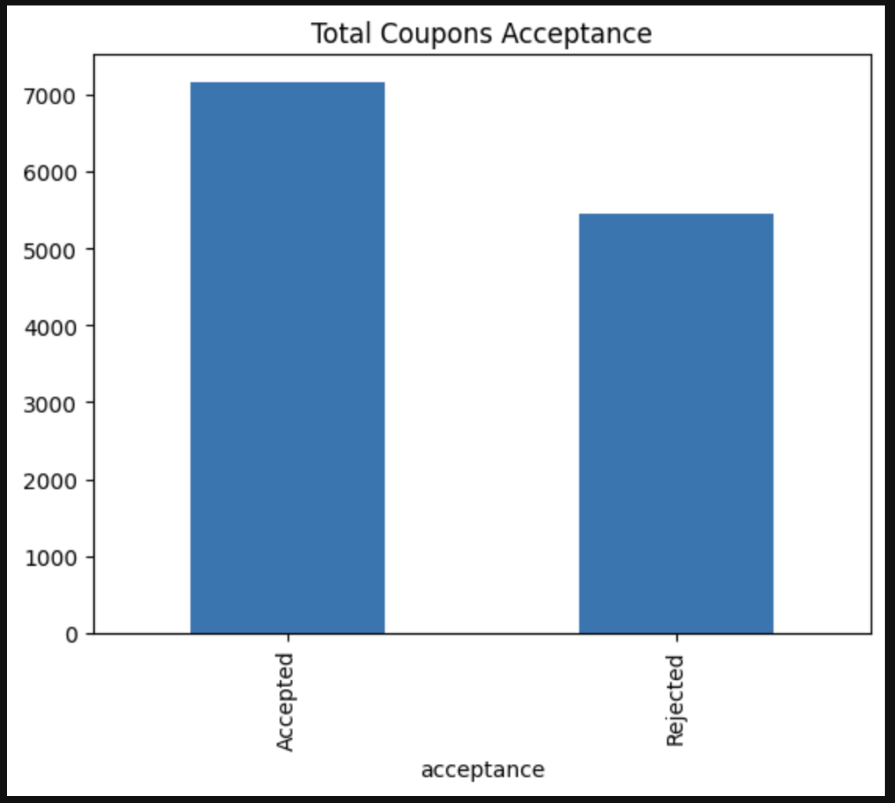

# Will a Customer Accept the Coupon?

# Data Description

The attributes of this data set include:
1. User attributes
    -  Gender: male, female
    -  Age: below 21, 21 to 25, 26 to 30, etc.
    -  Marital Status: single, married partner, unmarried partner, or widowed
    -  Number of children: 0, 1, or more than 1
    -  Education: high school, bachelors degree, associates degree, or graduate degree
    -  Occupation: architecture & engineering, business & financial, etc.
    -  Annual income: less than \\$12500, \\$12500 - \\$24999, \\$25000 - \\$37499, etc.
    -  Number of times that he/she goes to a bar: 0, less than 1, 1 to 3, 4 to 8 or greater than 8
    -  Number of times that he/she buys takeaway food: 0, less than 1, 1 to 3, 4 to 8 or greater
    than 8
    -  Number of times that he/she goes to a coffee house: 0, less than 1, 1 to 3, 4 to 8 or
    greater than 8
    -  Number of times that he/she eats at a restaurant with average expense less than \\$20 per
    person: 0, less than 1, 1 to 3, 4 to 8 or greater than 8
    -  Number of times that he/she goes to a bar: 0, less than 1, 1 to 3, 4 to 8 or greater than 8
    

2. Contextual attributes
    - Driving destination: home, work, or no urgent destination
    - Location of user, coupon and destination: we provide a map to show the geographical
    location of the user, destination, and the venue, and we mark the distance between each
    two places with time of driving. The user can see whether the venue is in the same
    direction as the destination.
    - Weather: sunny, rainy, or snowy
    - Temperature: 30F, 55F, or 80F
    - Time: 10AM, 2PM, or 6PM
    - Passenger: alone, partner, kid(s), or friend(s)


3. Coupon attributes
    - time before it expires: 2 hours or one day


<hr>

## Table of Contents: 
1. [Dataset](https://github.com/arezazadeh/data_analysis_projects#dataset)
2. Investigate the dataset for missing or problematic data.
3. Consolidating and Dropping Columns 
    - `toCoupon_GEQ5min`, `toCoupon_GEQ15min`, `toCoupon_GEQ25min` are consolicated to one column `distance`
    - `direction_same`, `direction_opp` columns are consolicated to one column `dir`
    - Rename values in `temperature` column to low medium and high in a new column `temp_cat`

4. What proportion of the total observations chose to accept the coupon? 
5. bar plot to visualize the `coupon` column.
<br>

<h3>Pending Completion</h3>

<hr>

### Dataset
```python
import pandas as pd 

data = pd.read_csv('data/coupons.csv')
pd.set_option('display.max_columns', 100)
```
<hr>
<br>

### Looking at the overall Coupon acceptance
<br>



