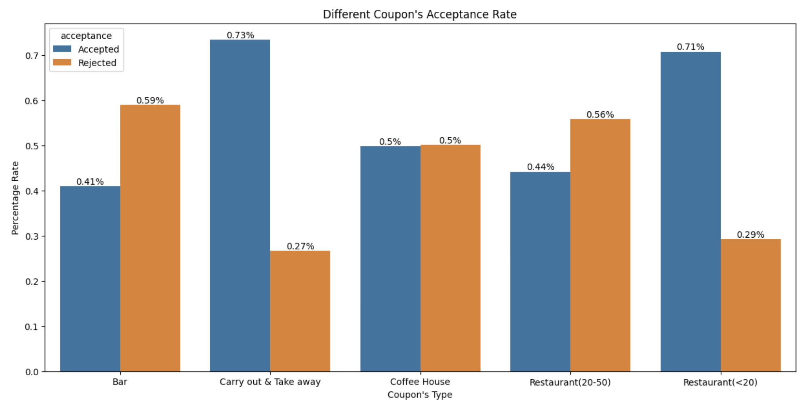
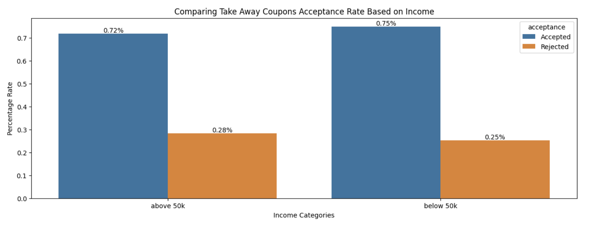
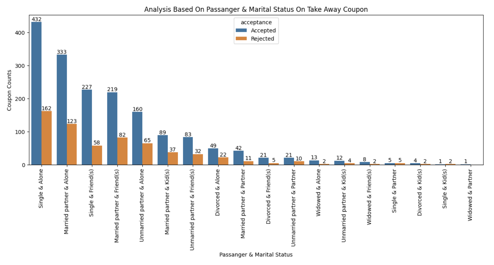
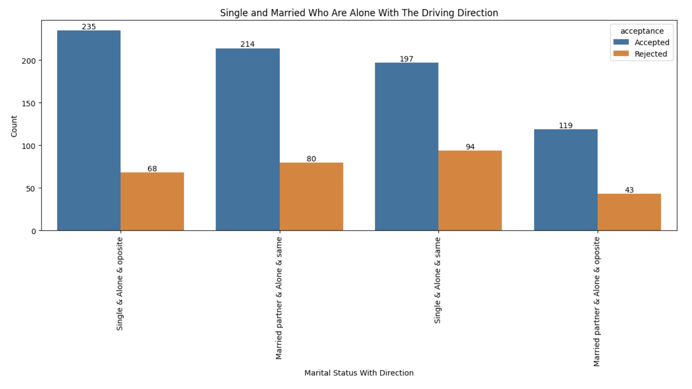
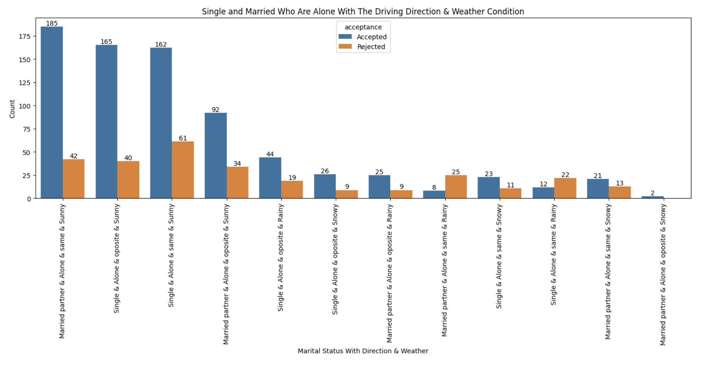

# Will a Customer Accept the Coupon?

# Data Description

The attributes of this data set include:
1. User attributes
    -  Gender: male, female
    -  Age: below 21, 21 to 25, 26 to 30, etc.
    -  Marital Status: single, married partner, unmarried partner, or widowed
    -  Number of children: 0, 1, or more than 1
    -  Education: high school, bachelors degree, associates degree, or graduate degree
    -  Occupation: architecture & engineering, business & financial, etc.
    -  Annual income: less than \\$12500, \\$12500 - \\$24999, \\$25000 - \\$37499, etc.
    -  Number of times that he/she goes to a bar: 0, less than 1, 1 to 3, 4 to 8 or greater than 8
    -  Number of times that he/she buys takeaway food: 0, less than 1, 1 to 3, 4 to 8 or greater
    than 8
    -  Number of times that he/she goes to a coffee house: 0, less than 1, 1 to 3, 4 to 8 or
    greater than 8
    -  Number of times that he/she eats at a restaurant with average expense less than \\$20 per
    person: 0, less than 1, 1 to 3, 4 to 8 or greater than 8
    -  Number of times that he/she goes to a bar: 0, less than 1, 1 to 3, 4 to 8 or greater than 8
    

2. Contextual attributes
    - Driving destination: home, work, or no urgent destination
    - Location of user, coupon and destination: we provide a map to show the geographical
    location of the user, destination, and the venue, and we mark the distance between each
    two places with time of driving. The user can see whether the venue is in the same
    direction as the destination.
    - Weather: sunny, rainy, or snowy
    - Temperature: 30F, 55F, or 80F
    - Time: 10AM, 2PM, or 6PM
    - Passenger: alone, partner, kid(s), or friend(s)


3. Coupon attributes
    - time before it expires: 2 hours or one day


<hr>

## Table of Contents: 
- [Loading The Dataset](https://github.com/arezazadeh/data_analysis_projects#Loading-The-Dataset)
- [Missing And Duplicated Data](https://github.com/arezazadeh/data_analysis_projects#missing-and-duplicated-data)
- [Consolidating Redundant Columns](https://github.com/arezazadeh/data_analysis_projects#Consolidating-Redundant-Columns)
- [Total Observation of Coupon Acceptance](https://github.com/arezazadeh/data_analysis_projects#Total-Observation-of-Coupon-Acceptance)
- [Visualizing The Coupon Column](https://github.com/arezazadeh/data_analysis_projects#Visualizing-The-Coupon-Column)
- [Analyzing Bar Visits And Coupon's Acceptance Rate](https://github.com/arezazadeh/data_analysis_projects#Analyzing-Bar-Visits-And-Coupon's-Acceptance-Rate)
- [Bar Coupon Hypothesize](https://github.com/arezazadeh/data_analysis_projects#Bar-Coupon-Hypothesize)
- [Independent Investigation](https://github.com/arezazadeh/data_analysis_projects#Independent-Investigation)
- [Acceptance Rate For Different Coupons](https://github.com/arezazadeh/data_analysis_projects#Acceptance-Rate-For-Different-Coupons)
- [Analyzing Carry Out And Take Away Coupon](https://github.com/arezazadeh/data_analysis_projects#Analyzing-Carry-Out-And-Take-Away-Coupon)
- [Conclusion on Take Away Coupon](https://github.com/arezazadeh/data_analysis_projects#Conclusion-on-Take-Away-Coupon)

<br>

<hr>

### <p style="font-weight:bold">Loading The Dataset</p>
```python
import pandas as pd 

data = pd.read_csv('data/coupons.csv')
pd.set_option('display.max_columns', 100)
```
<hr>
<br>

### <p style="font-weight:bold">Missing And Duplicated Data</p>

```python
destination              0.000000
passanger                0.000000
weather                  0.000000
temperature              0.000000
time                     0.000000
coupon                   0.000000
expiration               0.000000
gender                   0.000000
age                      0.000000
maritalStatus            0.000000
has_children             0.000000
education                0.000000
occupation               0.000000
income                   0.000000
car                     99.148534
Bar                      0.843582
CoffeeHouse              1.710817
CarryAway                1.190476
RestaurantLessThan20     1.024913
Restaurant20To50         1.490066
toCoupon_GEQ5min         0.000000
toCoupon_GEQ15min        0.000000
toCoupon_GEQ25min        0.000000
direction_same           0.000000
direction_opp            0.000000
Y                        0.000000
```
* The `car` column is 99% Null, and it seems like it doesnt have any impact to the overall of the dataset. Hence dropping the entire column
* The columns `Bar, CoffeeHouse, CarryAway, RestaurantLessThan20, Restaurant20To50` have some missing values, I have decided to fill them with `never` 
* There are also 74 duplicated row, which are dropped 
```
False    12610
True        74
```
<hr>

### <p style="font-weight:bold">Consolidating Redundant Columns</p>

* below columns have been consolicated:
    - New column is created based on the `Y` column, `acceptance`
    - `toCoupon_GEQ5min`, `toCoupon_GEQ15min`, `toCoupon_GEQ25min` are consolicated to one column `distance` 

    ```
        --------------------------------------------
        |   5   |   15   |   25   |    distance    |
        |-------------------------------------------
        |   1   |   0    |    0   |  within 5 min  |
        |   1   |   1    |    0   |  within 15 min |
        |   1   |   1    |    1   |  within 25 min |
        --------------------------------------------
    ```
    - `direction_same`, `direction_opp` columns are consolicated to one column `dir` <br>
    - Rename values in `temperature` column to low medium and high in a new column `temp_cat` <br>

<hr>

### <p style="font-weight:bold">Total Observation of Coupon Acceptance</p>
<br>

<li> as shown below, around 56% of the  drivers have accepted a coupon and around 43% of the drivers have rejected it.</li>
<br>
<div style="text-align:center">

</div>

<hr>

### <p style="font-weight:bold">Visualizing The Coupon Column</p>

* The overall distribution of coupons among the drivers. as indicated below, 32% of the coupons were Coffee House Coupons, and 22% Cheap Restaurants. 
<br>
<br>
<div style="text-align:center">
    
</div>

<hr>

### <p style="font-weight:bold">Analyzing Bar Visits And Coupon's Acceptance Rate</p>

1. Next, we will be looking at the drivers who visited a Bar 3 or fewer times a month and comparing them with other drivers who visited more or never. 

<div style="text-align:center">
    
</div>

As you can see in the above plot, drivers who went to bar less than 3 times a month, their acceptance and rejections are almost the same. But the drivers who went to Bar more than 3 times a month have 70% acceptance rate. 

2. Analyzing Bar visits for drivers who are 25 years or older and go Bar more than once a month. 

<div style="text-align:center">
    
</div>

3. Lets look at  the drivers who their occupations are not Farming, Fishing or Forestry and visit Bar more than once a month

<div style="text-align:center">
    
</div>


4. This comparisan is between:
    - Go to bars more than once a month, had passengers that were not a kid, and were not widowed OR
    - Go to bars more than once a month and are under the age of 30

As you below, in both cases the acceptance rate is around 70%. 

<div style="text-align:center">
    
</div>

<hr>

## <p style="font-weight:bold">Bar Coupon Hypothesis</p>

<p style="font-weight: 420 ;font-size:15px">Based on we have seen so far, most of the acceptance rates are from drivers who go to Bar more than once and have no Kids as their passangers.</p>

<hr>
<br>
<br>

# Independent Investigation

## <p style="font-weight:bold">Acceptance Rate For Different Coupons</p>

Lets look at the acceptance rate for each of the coupon's category. We saw the majority of coupon distribution belong to coffee house. now lets see the ratio of acceptance rate for coffee house coupons. 

<div style="text-align:center">
    
</div>

As seen above, Coffee House Coupons are at 50%-50% acceptance rate, unlike Carry outs and Take Away and Cheap restaurants. Let's start analyzing the Carry out and Take away coupon and find out the difference between accepted and rejected. 

<hr>

## <p style="font-weight:bold">Analyzing Carry Out And Take Away Coupon</p>

1. Checking Carry out and Take Away coupon's acceptance rate based on Income


<div style="text-align:center">
    
</div>


as we see above, there is not much difference between Income below 50k or above 50k on accepting Take Away coupons. But we will dive deeper into each category and see the different charactristics of each coupon acceptance 

2. Checking the Take Away coupons with Marital Status and Kid(s) as passanger 

<div style="text-align:center">
    
</div>

As indicated above, more coupons were accepted by drivers who are Married or Single that are Alone. But most of coupon accetance belong to Single with No Passanger

3. Checking the Take Away Coupons with Marital Status and Kid(s) as Passanger with Direction of the coupon 


<div style="text-align:center">
    
</div>

As the plot above shows, Drivers who are single and Alone are willing to go to oposite direction for take away food vs. Married drivers.

Next lets add weather condition to this mix and find out how many single or married are willing to go to the oposite direction 

4. Checking the Take Away Coupons with Marital Status and Kid(s) as Passanger with Direction of the coupon and Weather condition


<div style="text-align:center">
    
</div>

<h2>Conclusion on Take Away Coupon</h2>

Above shows that Married drivers without any passanger who are going on the same direction as the coupon, and in a sunny day, are more likely to accept the coupon for Take Away. But on the other hand we can see the Single drivers are also alone in the car in a sunny day are willing to go to oposite direction

We can also dig deeper and add other variables to our analysis and see what other factors causes drivers to accept or reject the coupon. For instance, we can also include time of the day, or destination which i am sure will have direct impact on acceptance rate. 
